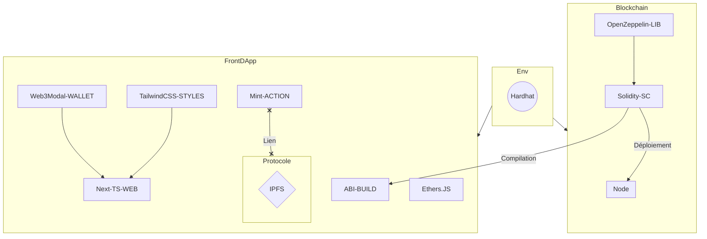

# NFT Marketplace

<hr/>

## Getting Started

## Environment variables

Before starting, be sure to have an .env file at the root of the project with each of these values filled:

```bash
NEXT_PUBLIC_AVAX_TESTNET_URL=WE_USE_AVALANCHE_TESTNET_FOR_DEPLOYING_OUR_CONTRACTS

NEXT_PUBLIC_PRIVATE_KEY=AVALANCHE_PRIVATE_KEY_TESTNET

NEXT_PUBLIC_INFURA_ID=INFURA_ID_FOR_ETHEREUM_NODE

#As we are developing our marketplace locally, just run cp .env.example .env
```

After, be sure to have [NodeJs](https://nodejs.org/en/) & [NPM](https://www.npmjs.com/) installed, we recommand to use [NVM](https://github.com/nvm-sh/nvm) for better node version management.

### Client

Install dependencies:

```bash
npm install
# or
yarn install
```

Run the development server:

```bash
npm run dev
# or
yarn dev
```

Open [http://localhost:3000](http://localhost:3000) with your browser to see the result.

### Blockchain environment

Compile smart contracts

```bash
npx hardhat compile
Compiling...
Compiling 1 contract successfully
```

Deploy smart contracts

```bash
npx hardhat run --network <chosen-network> scripts/deploy.ts

#For testing purpose, choose avatest (cf. hardhat.config.ts). Be aware if a deploy on a mainnet is attempted, some gas fees may be applied.
```

Test smart contracts

```bash
npx hardhat test
```

Once deployed, the contracts addresses will be shown on cache/deploy.ts

### Wallet

Be sure to have a crypto wallet for testing purpose. As we are using the web3modal plugin, please check this [list](https://github.com/Web3Modal/web3modal) for the compatibles wallets.
Fake AVAX (token of Avalanche blockchain) can be claim through this link: https://faucet.avax-test.network/

## Project structure

    .
    ├── src                 # DApp NextJs client
    │   ├── artifacts       # Build result (abi, bytecode) after SC deployed
    │   ├── assets          # Images
    │   ├── components      # Reusable components
    │   ├── config          # Configuration files --> Redux, sockets, axios
    │   ├── styles          # CSS classes, theme, fonts
    │   ├── types           # TS types, enum & interfaces
    │   ├── utils           # Helper functions
    │   └── pages           # Different pages
    │       └──api          # Backend API routes
    │
    └── contracts           # Smart contracts
    │
    └── artifacts           # Contracts ABI
    │
    └── scripts             # Contract deploy script
    │
    └── test                # Contracts tests
    │
    └── typechain           # TS typings generated along with the contracts



## Stack

**Blockchain**

- [Solidity](https://docs.soliditylang.org/en/v0.8.12/)
- [Openzeppelin](https://openzeppelin.com/)
- [Hardhat](https://hardhat.org/)

**DApp frontend**

- [TypeScript](https://www.typescriptlang.org)
- [Ethers.js](https://docs.ethers.io/v5/)
- [Web3Modal](https://github.com/Web3Modal/web3modal)
- [Tailwind CSS](https://tailwindcss.com/)
- [Redux](https://redux.js.org/)

## Preview


